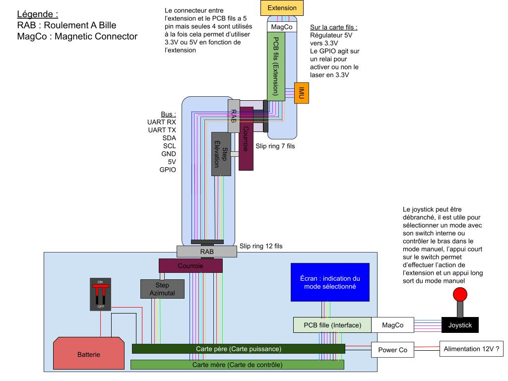

## Project Description
The "Stellar Index" is an autonomous and aesthetic mechanical arm, designed to point in real time at a specific celestial object selected via a mobile or web app. Whether it's a planet, a star, the International Space Station (ISS), or a galaxy, the arm tracks the object continuously.

If the object goes below the horizon, the arm will point toward the ground. Designed with premium materials, it serves as both an educational science tool and an indoor kinetic art piece.

---

## Specifications & Technical Challenges

Here is the list of project requirements, along with recommended hardware choices and the technical challenges to anticipate.

### 1. Continuous 360° Celestial Tracking
**Description:** The arm must dynamically target a celestial object and compensate for Earth's rotation in real time, with no limits on its rotation.
- **Hardware:** A base motor for the Azimuth (horizontal) axis, a motor for the Elevation (vertical) axis, and a **slip ring** placed in the center of the rotation axis.
- **Difficulty:** Infinite rotation on the vertical axis requires a slip ring to pass the power and data cables from the base to the arm so they don't twist and snap.

### 2. Automatic Calibration via IMU and GNSS/GPS
**Description:** The user sets the object down, turns it on, and the system automatically determines its location, exact time, and spatial orientation (North, level) without manual input.
- **Hardware:** A GPS module (e.g., u-blox NEO-M8N for a quick lock) and a 9-axis Inertial Measurement Unit (IMU) with a built-in data fusion processor (e.g., BNO085 or BNO055).
- **Difficulty:** The IMU's magnetometer (compass) is extremely sensitive to ferrous metals and magnetic fields from the motors. The IMU must be placed as far away from the motors as possible (at the end of the arm), and a calibration algorithm is needed to compensate for the surrounding metal.

### 3. Easy to Transport (Foldable)
**Description:** The arm must fold down to fit into a custom carrying case.
- **Hardware:** Precision ball-bearing joints and **absolute magnetic encoders** (e.g., AS5600) on each critical axis.
- **Difficulty:** If the arm is folded while turned off, the system must know exactly what position it is in when turned back on. Absolute encoders are mandatory here because they remember the exact physical position, unlike standard relative encoders.

### 4. Elegant Design and Premium Materials (Brass)
**Description:** A high-end finish so it blends in as premium home decor.
- **Hardware:** Solid brass for the base, and anodized aluminum tubes (brass look) or brass-plated carbon fiber for the moving parts. Hidden screws.
- **Difficulty:** Brass is very dense and heavy. An arm made entirely of solid brass would require very powerful motors, which are bulky, noisy, and drain power quickly. You have to "cheat" on the moving parts by using lightweight materials that just look like brass.

### 5. Silent Operation
**Description:** The arm's movements must be virtually inaudible.
- **Hardware:** Ultra-silent motor drivers (e.g., Trinamic TMC2209 with StealthChop technology) for stepper motors, or FOC controllers (SimpleFOC) for brushless motors. Vibration dampers between the motors and the frame.
- **Difficulty:** Acoustically isolating the mechanical transmission (gears or belts). Neoprene timing belts are generally much quieter than metal gears.

### 6. Power Supply: Battery and Mains (10-hour battery life)
**Description:** Dual operation, featuring a custom built-in battery.
- **Hardware:** A Lithium-Ion cell pack (e.g., high-capacity 18650 or 21700 cells), a BMS (Battery Management System) board for safe charging/discharging, and a circuit that automatically switches between battery and wall power.
- **Difficulty:** Sizing the battery. When motors hold a position, they constantly drain energy to fight gravity. The arm must be physically balanced (by adding discreet counterweights) so the motors have to do as little work as possible.

### 7. Interface and Control
**Description:** A premium physical ON/OFF switch. The main control interface is a connected app via an API.
- **Hardware:** An **ESP32** microcontroller (which natively includes WiFi and Bluetooth BLE), and a metal toggle switch or capacitive push button integrated into the base design.
- **Difficulty:** Writing the software backend on the ESP32 so it can host a local API (an embedded web server) or seamlessly connect to the home WiFi using the user's phone Bluetooth.

### 8. Extended Offline Operation (72 hours)
**Description:** The arm must be able to track a target for 72 hours without an internet connection.
- **Hardware:** A high-precision, temperature-compensated **RTC (Real-Time Clock)** module (e.g., DS3231) with its own backup coin battery (CR2032).
- **Difficulty:** Time drift. Without the internet to resync the clock, a standard microcontroller loses several seconds a day. In astronomy, being off by just a few seconds completely ruins the pointing accuracy, making a dedicated RTC module absolutely necessary.

### 9. Interchangeable Tips
**Description:** The end of the arm can hold different attachments, like a "mechanical finger" or a laser pointer.
- **Hardware:** A quick-release connector (neodymium magnets with an alignment slot or a bayonet mount), and **Pogo Pins** (spring-loaded contacts) to send electricity to the laser module.
- **Difficulty:** Sending power to the laser tip without any visible wires, and making sure the tip always centers perfectly on the axis every time it gets swapped out.

### 10. Closed-Loop Control
**Description:** The system automatically corrects its own position errors (like if it gets bumped or misses a step).
- **Hardware:** High-resolution rotary encoders (e.g., AS5048A with 14-bit resolution) attached directly to the motor shafts.
- **Difficulty:** Software integration. You need to write a PID (Proportional, Integral, Derivative) controller into the code. This allows the microcontroller to compare where the arm *should* be with where the encoder says it *actually* is thousands of times per second, correcting the movement smoothly without making the arm shake.

---

  

## Basic Electronic Stack (Summary)
* **Brain:** ESP32
* **Time & Space:** u-blox GPS, BNO085 IMU, DS3231 RTC
* **Movement:** Motors + Trinamic TMC2209 Drivers + Slip Ring
* **Position Sensors:** Absolute magnetic encoders (AS5600 / AS5048A)

